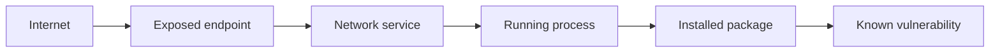
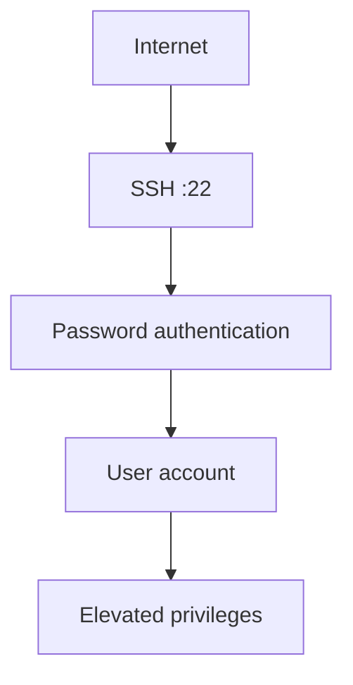
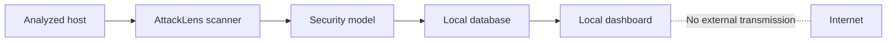
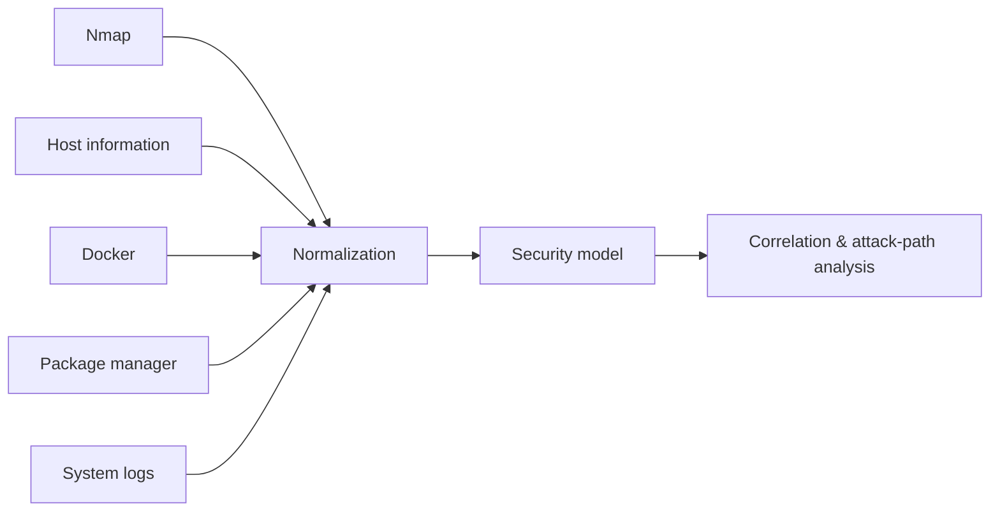
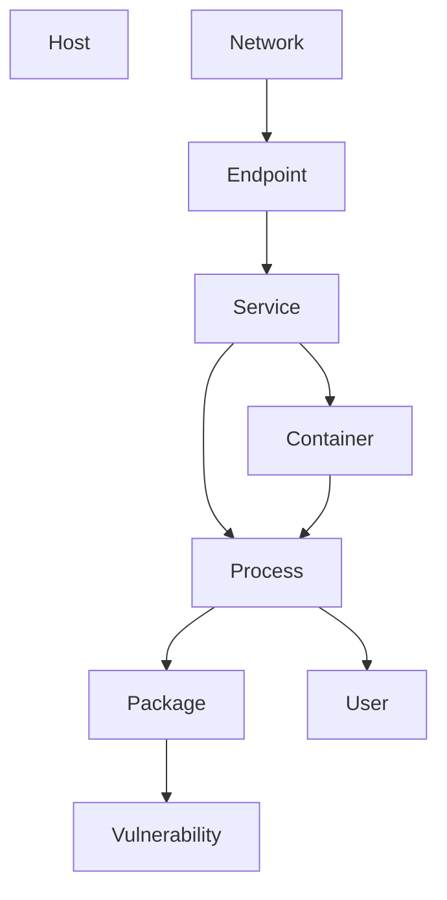
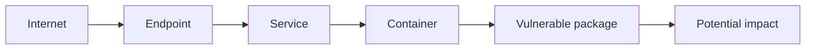
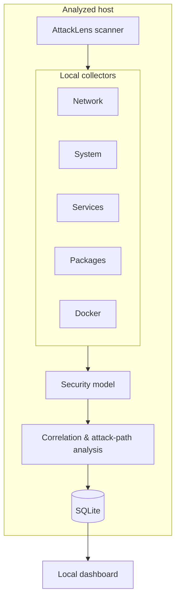

# AttackLens

**Local attack surface and attack path analyzer for hosts and Docker environments.**

AttackLens analyzes a host locally and builds a contextual security model by correlating network exposure, running services, system configuration, containers, and known vulnerabilities.

The goal is not to replace existing security tools such as Nmap, Greenbone, Lynis, or Trivy. Instead, AttackLens uses information from these tools and from the host itself to identify relationships between components and potential attack paths.

> **Detecting a vulnerability is not enough. AttackLens aims to understand how that vulnerability fits into the security context of the host.**

---

## Why AttackLens?

Security scanners often produce isolated findings:

```text
Open port
Vulnerable package
Weak configuration
Exposed container
```

AttackLens tries to connect these findings:



This makes it possible to reason about potential attack paths rather than treating every finding independently.

For example:



The objective is to determine whether such relationships actually exist on the analyzed host and provide the evidence supporting them.

---

## Core principles

### Local-first

Collected security information stays on the analyzed machine.



The core application does not require a cloud service or remote backend.

### Least privilege

The scanner should operate without root privileges whenever possible.

Privileged operations, if eventually required, should be isolated and explicitly justified rather than running the entire application as root.

### Evidence-based analysis

Every security finding should be traceable to collected evidence.

```text
Finding
   │
   ├── Evidence: exposed port
   ├── Evidence: running service
   ├── Evidence: affected package
   └── Evidence: reachable component
```

### Existing tools over reinvention

AttackLens is not intended to reimplement mature security tools.



---

## What AttackLens is not

AttackLens is **not** intended to become:

* a SIEM
* an IDS/IPS
* an antivirus
* a replacement for Nmap
* a replacement for Greenbone/OpenVAS
* a replacement for Lynis
* a general-purpose vulnerability scanner
* a cloud security platform

Its purpose is **contextual host security analysis and attack-path identification**.

---

## Initial scope

The first version focuses on a single host.

### Attack surface

* Network interfaces
* Listening ports
* Network services
* Firewall state
* Processes

### System context

* Operating system
* Installed packages
* Running services
* Users and privileges
* Docker environments

### Vulnerability context

* Installed vulnerable packages
* CVEs
* Affected versions
* Fixed versions
* Vulnerability metadata

### Security relationships

AttackLens will model relationships such as:



### Attack paths

The analysis engine will use these relationships to identify potential paths such as:



---

## Architecture

The initial architecture intentionally contains as few components as possible.



The scanner runs directly on the host because it needs to inspect the host itself.

The dashboard is intentionally separated from the scanner and does not require privileged access to the host.

---

## Technology

### Scanner

* Python 3.12+
* psutil
* Native Linux interfaces and commands
* Nmap where appropriate
* Docker API where appropriate

### Storage

* SQLite

### Dashboard

Planned for a later milestone:

* FastAPI
* React
* TypeScript

### Development

* pytest
* Ruff
* GitHub Actions

---

## Project status

AttackLens is currently in early development.

The first milestone is intentionally small:

1. Establish the scanner CLI
2. Collect local system information
3. Collect network exposure
4. Normalize collected information
5. Build the first security model
6. Detect the first relationships
7. Implement the first attack-path rules

The web dashboard will be developed after the underlying security model is stable.

---

## Development

### Requirements

* Python 3.12+
* Linux for the initial scanner implementation

### Installation

Clone the repository and create a virtual environment:

```bash
python -m venv .venv
source .venv/bin/activate
```

Install AttackLens in editable mode:

```bash
pip install -e ".[dev]"
```

### Run

```bash
attacklens
```

### Tests

```bash
pytest
```

### Lint

```bash
ruff check .
```

---

## Security

AttackLens can process sensitive information about a host, including network exposure, installed software, processes, services, containers, and security configuration.

For this reason, security is considered a core project requirement.

See [`SECURITY.md`](SECURITY.md) for the security policy and design principles.

---

## License

AttackLens is released under the MIT License.
