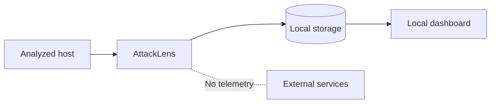

# Security Policy

## Overview

AttackLens is a local security analysis tool designed to analyze machines controlled by the user.

The scanner may access sensitive information about the analyzed host. Security and privacy are therefore considered core requirements of the project.

## Security principles

AttackLens follows these principles:

* Security data remains local by default.
* No telemetry is enabled by default.
* No credentials or secrets are collected unnecessarily.
* The scanner does not require root privileges by default.
* The dashboard does not require privileged access to the host.
* Host access should be explicitly justified and minimized.
* Findings should be supported by observable evidence.
* External services are not required for the core analysis.

## Data handling

AttackLens may collect information such as:

* Network interfaces
* Listening ports
* Running processes
* Installed packages
* Running services
* Container metadata
* Security configuration
* User and permission information

This information can be sensitive.

The project therefore follows a local-first architecture:



No collected security information should be transmitted externally by default.

## Privilege model

AttackLens should follow the principle of least privilege.

The scanner should run as an unprivileged user whenever possible.

The following approach is intentionally avoided:

```text
sudo attacklens
```

for the entire application.

If a future feature genuinely requires additional privileges, the access mechanism must be narrowly scoped and documented.

## Sensitive information

AttackLens should avoid collecting:

* Passwords
* Private keys
* Authentication tokens
* API keys
* Session cookies
* Secret values

When configuration files contain sensitive information, the scanner should collect only the metadata required for the security analysis and redact sensitive values.

## Reporting a vulnerability

If you discover a security vulnerability in AttackLens, please report it privately to the project maintainers rather than opening a public issue.

A report should include:

* A description of the vulnerability
* Steps to reproduce it
* The affected component
* The potential security impact
* Suggested mitigation, if available

Do not include real credentials, private keys, personal data, or other sensitive information in vulnerability reports.
